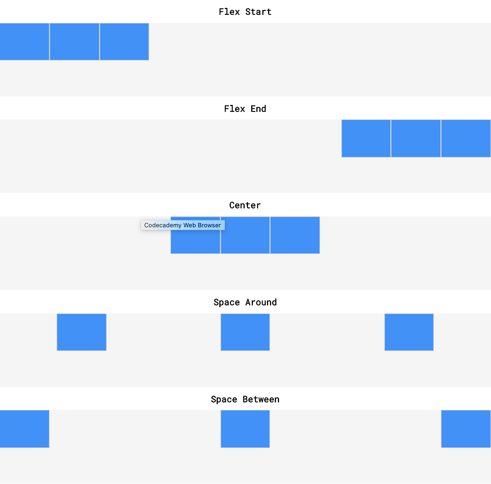
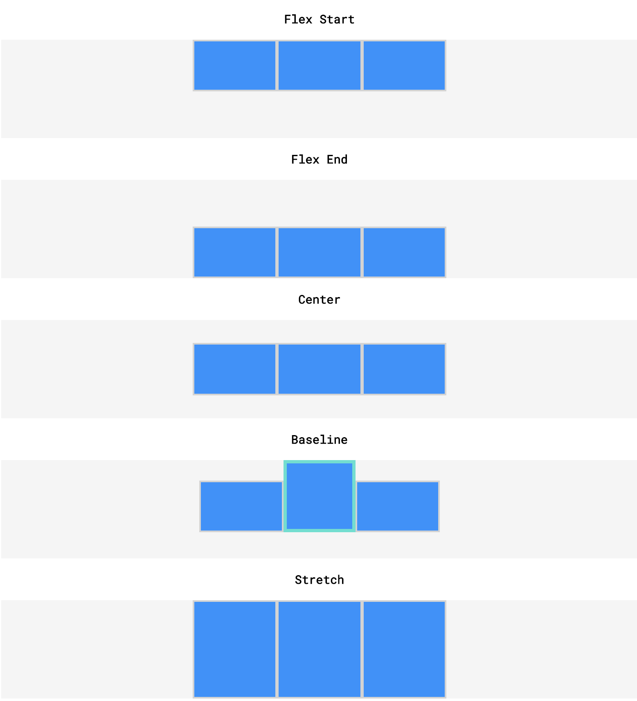
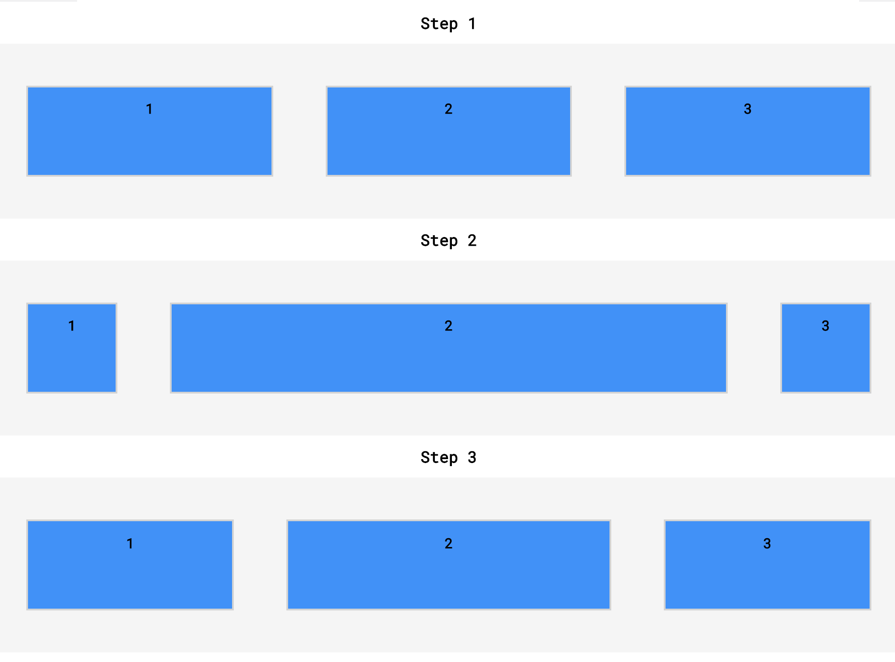
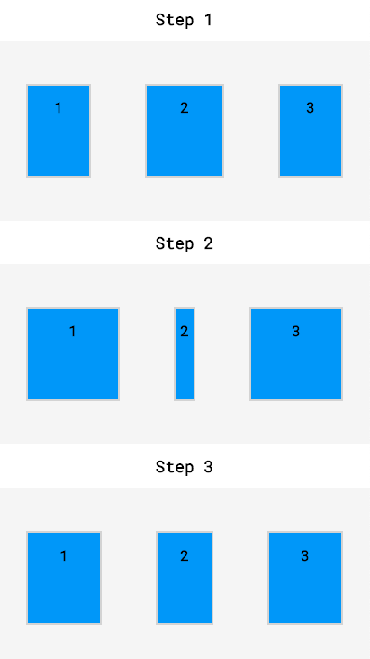
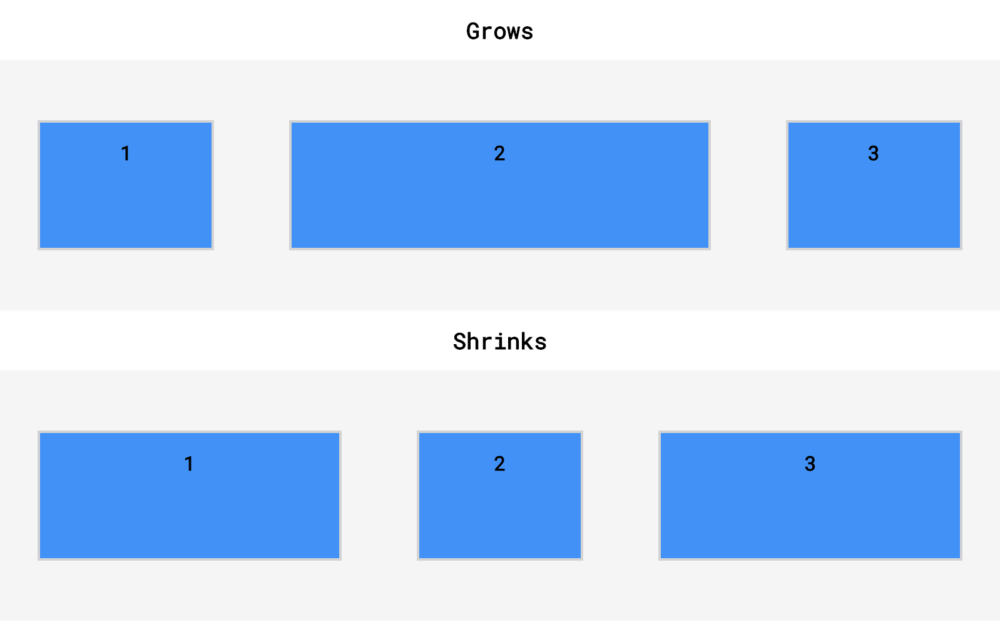
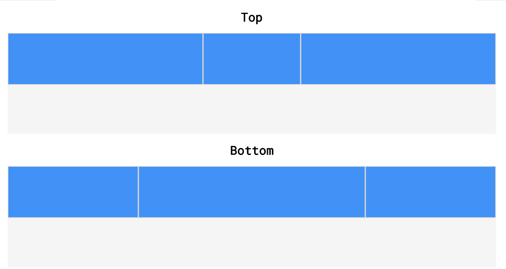

# Display and Positioning

## Flow of HTML
A browser will render the elements of an HTML document that has no CSS from left to right, top to bottom, in the same order as they exist in the document. This is called the flow of elements in HTML.

**Block-level elements** - create a block the full width of their parent elements and prevent other elements from appearing in the same horizontal space.
**In-line-level elements** -

### 5 properties for adjusting the position of HTML elements in the browser:
* position
  * static
  * relative
  * absolute 
  * fixed
* display
* z-index
* float
* clear

## Position: Relative
This value allows you to position an element relative to its default static position on the web page.
```
.box-bottom {
  background-color: DeepSkyBlue;
  position: relative;
  top: 20px;
  left: 50px;
}
```
In the example above, the `<div>` has been positioned using two of the four offset properties. The valid offset properties are:
* top - moves the element down.
* bottom - moves the element up.
* left - moves the element right.
* right - moves the element left.

In the example above, the `<div>` will be moved down 20 pixels and to the right 50 pixels from its default static position. 

Units for offset properties can be specified in pixels, ems, or percentages. **Note** that offset properties will not work if the value of the element’s position property is the default static.


1. The position property allows you to specify the position of an element in three different ways.
2. When set to relative, an element’s position is relative to its default position on the page.
3. When set to absolute, an element’s position is relative to its closest positioned parent element. It can be pinned to any part of the web page, but the element will still move with the rest of the document when the page is scrolled.
4. When set to fixed, an element’s position can be pinned to any part of the web page. The element will remain in view no matter what.
5. The z-index of an element specifies how far back or how far forward an element appears on the page when it overlaps other elements.
6. The display property allows you control how an element flows vertically and horizontally a document.
inline elements take up as little space as possible, and they cannot have manually-adjusted width or height.
block elements take up the width of their container and can have manually-adjusted heights.
inline-block elements can have set width and height, but they can also appear next to each other and do not take up their entire container width.
7. The float property can move elements as far left or as far right as possible on a web page.
8. You can clear an element’s left or right side (or both) using the clear property.


### Position: Absolute
When an element’s position is set to absolute all other elements on the page will ignore the element and act like it is not present on the page. The element will be positioned relative to its closest positioned parent element.
```
.box-bottom {
  background-color: DeepSkyBlue;
  position: absolute;
  top: 20px;
  left: 50px;
}
```
In the example above, the .box-bottom `<div>` will be moved down and right from the top left corner of the view. **If offset properties weren’t specified, the top box would be entirely covered by the bottom box**

### Position: Fixed
When an element’s position is set to absolute, as in the last exercise, the element will scroll with the rest of the document when a user scrolls.

### Z-Index
When boxes on a web page have a combination of different positions, the boxes (and therefore, their content) can overlap with each other, making the content difficult to read or consume.

The z-index property controls the depth of elements, with deeper elements appearing behind shallower elements.
```
.box-top {
  background-color: Aquamarine;
  position: relative;
  z-index: 2;
}

.box-bottom {
  background-color: DeepSkyBlue;
  position: absolute;
  top: 20px;
  left: 50px;
  z-index: 1;
}
```
The z-index property does not work on static elements.

### Inline Display
Every HTML element has a default display value that dictates if it can share horizontal space with other elements. Some elements fill the entire browser from left to right regardless of the size of their content. Other elements only take up as much horizontal space as their content requires and can be directly next to other elements.

Three values for the display property: 
* inline
* block
* inline-block.

#### inline
Inline elements have a box that wraps tightly around their content, only taking up the amount of space necessary to display their content and not requiring a new line after each element. 

Inline elements cannot be altered in size with the height or width CSS properties.

The CSS display property provides the ability to make any element an inline element. This includes elements that are not inline by default such as paragraphs, divs, and headings.
```
h1 {
  display: inline;
}
```
The CSS in the example above will change the display of all `<h1>` elements to inline. The browser will render `<h1>` elements on the same line as other inline elements immediately before or after them (if there are any).

### block
These elements fill the entire width of the page by default, but their width property can also be set. Unless otherwise specified, they are the height necessary to accommodate their content.

### inline-block
Inline-block elements can appear next to each other and we can specify their dimensions using the width and height properties. Images are the best example of default inline-block elements.

## Float
The float property can be set to one of two values:

`left` - this value will move, or float, elements as far left as possible.

`right` - this value will move elements as far right as possible.
```
.boxes {
  width: 120px;
  height: 70px;
}

.box-bottom {
  background-color: DeepSkyBlue;
  float: right;
}
```
In the example above, we float the .box-bottom element to the right. This works for static and relative positioned elements. See the result of the code below:

Floated elements must have a width specified, as in the example above. Otherwise, the element will assume the full width of its containing element, and changing the float value will not yield any visible results.

## Clear
The float property can also be used to float multiple elements at once. However, when multiple floated elements have different heights, it can affect their layout on the page. Specifically, elements can “bump” into each other and not allow other elements to properly move to the left or right.

The clear property specifies how elements should behave when they bump into each other on the page. It can take on one of the following values:

`left` — the left side of the element will not touch any other element within the same containing element.

`right` — the right side of the element will not touch any other element within the same containing element.

`both` — neither side of the element will touch any other element within the same containing element.
none — the element can touch either side.
```
div {
  width: 200px;
  float: left;
}

div.special {
  clear: left;
}
```
In the example above, all `<div>`s on the page are floated to the left side. The element with class special did not move all the way to the left because a taller `<div>` blocked its positioning. By setting its clear property to left, the special `<div>` will be moved all the way to the left side of the page.

* All HTML elements are rectangular boxes to the browser
* The browser determines the size of the box unless we override it
* We should reset the box-model as it makes life easier for us as developers
* It's advised to use a reset stylesheet and set `box-sizing: border-box`
* Reset stylesheet: https://meyerweb.com/eric/tools/css/reset/

# The Box Model

## Introduction to the Box Model
* Browsers load HTML elements with default position values. This often leads to an unexpected and unwanted user experience, while limiting the views you can create. 
* All elements on a web page are interpreted by the browser as “living” inside of a box. This is what is meant by the box model.
* When you change the background color of an element, you change the background color of its entire box.

### Of an Element's Box:
1. Width and height — specifies the width and height of the content area.
2. Padding — specifies the amount of space between the content area and the border.
3. Border — specifies the thickness and style of the border surrounding the content area and padding.
4. Margin — specifies the amount of space between the border and the outside edge of the element.

## Centring Content
The margin property also lets you center content. 
```
div {
  margin: 0 auto;
}
```
In the example above, `margin: 0 auto;` will center the divs in their containing elements. 
The `0` sets the top and bottom margins to 0 pixels. The auto value instructs the browser to adjust the left and right margins until the element is centered within its containing element.

In order to center an element, a **width must be set for that element.** Otherwise, the width of the div will be automatically set to the full width of its containing element, like the `<body>`, for example. It’s not possible to center an element that takes up the full width of the page.
```
div.headline {
  width: 400px;
  margin: 0 auto;
}
```

## Margin Collapse
* Top and bottom margins, also called vertical margins, collapse, while top and bottom padding does not.
* Horizontal margins (left and right), like padding, are always displayed and added together. 

```
#img-one {
  margin-right: 20px;
}

#img-two {
  margin-left: 20px;
}
```

Vertical margins collapse, so the space between vertically adjacent elements is equal to the larger margin.
```
#img-one {
  margin-bottom: 30px;
}

#img-two {
  margin-top: 20px;
}
```

## Overflow
All of the components of the box model comprise an element’s size. For example, an image that has the following dimensions is 364 pixels wide and 244 pixels tall.

* 300 pixels wide
* 200 pixels tall
* 10 pixels padding on the left and right
* 10 pixels padding on the top and bottom
* 2 pixels border on the left and right
* 2 pixels border on the top and bottom
* 20 pixels margin on the left and right
* 10 pixels margin on the top and bottom

**Sometimes, these components result in an element that is larger than the parent’s containing area.** How can we ensure that we can view all of an element that is larger than its parent’s containing area?

The overflow property controls what happens to content that spills, or overflows, outside its box. It can be set to one of the following values:

`hidden` - when set to this value, any content that overflows will be hidden from view.
`scroll` - when set to this value, a scrollbar will be added to the element’s box so that the rest of the content can be viewed by scrolling.
`visible` - when set to this value, the overflow content will be displayed outside of the containing element. Note, this is the default value.
```
p {
  overflow: scroll; 
}
```
The overflow property is **set on a parent element** to instruct a web browser how to render child elements. For example, if a div’s overflow property is set to scroll, all children of this div will display overflowing content with a scroll bar.

## Resetting Defaults
All major web browsers have a default stylesheet they use in the absence of an external stylesheet. These default stylesheets are known as user agent stylesheets.User agent stylesheets often have default CSS rules that set default values for padding and margin. 

Many developers choose to reset these default values so that they can truly work with a clean slate.
```
* {
  margin: 0;
  padding: 0;
}
```
The code in the example above resets the default margin and padding values of all HTML elements. It is often the first CSS rule in an external stylesheet.

Note that both properties are both set to 0. When these properties are set to 0, they do not require a unit of measurement.

## Visibility
Elements can be hidden from view with the visibility property.

The visibility property can be set to one of the following values:

`hidden` — hides an element.
`visible` — displays an element.
```
<ul>
  <li>Explore</li>
  <li>Connect</li>
  <li class="future">Donate</li>
<ul>

.future {
  visibility: hidden;
}
```

**Note:** An element with display: none will be completely removed from the web page. An element with visibility: hidden, however, will not be visible on the web page, but the space reserved for it will.


## Changing the Box Model
The `box-sizing property` controls the type of box model the browser should use when interpreting a web page.
The default value of this property is `content-box`. This is the same box model that is affected by border thickness and padding.

### Box Model: Border-Box
We can reset the entire box model and specify a new one: border-box.
```
* {
  box-sizing: border-box;
}
```
The code in the example above resets the box model to border-box for all HTML elements.


In this box model, the height and width of the box will remain fixed. The border thickness and padding will be included inside of the box, which means the overall dimensions of the box do not change.
```
<h1>Hello World</h1>
* {
  box-sizing: border-box;   // 
}

h1 {
  border: 1px solid black;
  height: 200px;
  width: 300px;
  padding: 10px;
}
```
In the example above, the height of the box would remain at 200 pixels and the width would remain at 300 pixels. The border thickness and padding would remain entirely inside of the box.

### The Box Model in Dev-Tools
* `CMD + Shift + C` - Shortcut to Chrome Dev-Tools
* Opens the Elements Panel
* Click on `Computed` Tab
* No values are shown with a `-`
* CLick the `+` to add new CSS rules in the Styles tab

#### Height of Box = Content Height + Padding (Top & Bottom) + Border (Top & Bottom)

#### Width of Box = Content Width + Padding (Left & Right) + Border (Left & Right)

Margin has no effect on how big or small an HTML Element's box is. It only effects proximity. 


# Color

There are four ways to represent color in CSS:

* Named colors — there are 147 named colors, which you can review here.
* Hexadecimal or hex colors
  * Hexadecimal is a number system with has sixteen digits, 0 to 9 followed by “A” to “F”.
  * Hex values always begin with # and specify values of red, blue and green using hexademical numbers such as #23F41A.
* RGB
  * RGB colors use the rgb() syntax with one value for red, one value for blue and one value for green.
  * RGB values range from 0 to 255 and look like this: rgb(7, 210, 50).
* HSL
  * HSL stands for hue (the color itself), saturation (the intensity of the color), and lightness (how light or dark a color is).
  * Hue ranges from 0 to 360 and saturation and lightness are both represented as percentages like this: hsl(200, 20%, 50%).
* You can add opacity to color in RGB and HSL by adding a fourth value, a, which is represented as a percentage.


# Typography

## Font Family
1. The font specified in a stylesheet must be installed on a user’s computer in order for that font to display when a user visit the web page. We’ll learn how to work around this issue in a later exercise.
2. You’ve probably noticed that we haven’t been specifying a typeface in previous exercises of this course. How exactly does the browser know what typeface to use when displaying the web page? The default typeface for all most browsers is Times New Roman. You may be familiar with this typeface if you have ever used a formatted word processor.
3. It’s a good practice to limit the number of typefaces used on a web page to 2 or 3.
4. When the name of a typeface consists of more than one word, it must be enclosed in double quotes (otherwise it will not be recognized), like so:
```
h1 {
  font-family: "Courier New";
}
```

## Font Weight
When using numeric weights, there are a number of default font weights that we can use:

1. 400 is the default font-weight of most text.
2. 700 signifies a bold font-weight.
3. 300 signifies a light font-weight.

## Fallback Fonts
What happens when a stylesheet requires a font that is not installed on a user’s computer? Most computers have a small set of typefaces pre-installed. This small set includes serif fonts like Times New Roman and sans-serif fonts like Arial.

These pre-installed fonts serve as fallback fonts if the stylesheet specifies a font which is not installed on a user’s computer.

To use fallback fonts, the following syntax is required:
```
h1 {
  font-family: "Garamond", "Times", serif;
}
```
The CSS rule above says:
Use the Garamond font for all `<h1>` elements on the web page.
If Garamond is not available, use the Times font.
If Garamond and Times are not available, use any serif font pre-installed on the user’s computer.

## Linking Fonts II
When we have the link to the font of our choice, we can add the font to the `<head>` section of the HTML document, using the `<link>` tag and the href.


# Responsive Design | Sizing Elements
Responsive design refers to the ability of a website to resize and reorganize its content based on:

1. The size of other content on the website.
2. The size of the screen the website is being viewed on.

## Pixels
Pixels are used to size content to exact dimensions. For example, if you want a div to be exactly 500 pixels wide and 100 pixels tall, then the unit of px can be used. Pixels, however, are **fixed, hard coded values.** When a screen size changes (like switching from landscape to portrait view on a phone), elements sized with pixels can appear too small, overflow the screen, or become completely illegible.

With CSS, you can avoid hard coded measurements and use relative measurements instead. **Relative measurements** offer an advantage over hard coded measurements, as they **allow for the proportions of a website to remain intact regardless of screen size or layout.**

## Em
The em represents the size of the **base font** being used. 

For example, **if the base font of a browser is 16 pixels** (which is normally the default size of text in a browser), **then 1 em is equal to 16 pixels.** 2 ems would equal 32 pixels, and so on.
```
.heading {
  font-size: 2em;
}
```
In the example above, **no base font has been specified**, therefore the font size of the heading element will be set relative to the default font size of the browser. Assuming the default font size is 16 pixels, then the font size of the heading element will be 32 pixels.
```
.splash-section {
  font-size: 18px;
}

.splash-section h1 {
  font-size: 1.5em;
}
```
The example above shows how to use ems **without relying on the default font size of the browser.** Instead, a base font size (18px) is **defined** for all text within the splash-section element. The second CSS rule will set the font size of all h1 elements inside of splash-section relative to the base font of splash-section (18 pixels). The resulting font size of h1 elements will be 27 pixels.

## Rem
The second relative unit of measurement in CSS is the rem, coded as rem.

Rem stands for root em. It acts similar to em, but instead of checking parent elements to size font, it checks the root element. The root element is the `<html>` tag.

Most browsers set the font size of `<html>` to 16 pixels, so by default rem measurements will be compared to that value. To set a different font size for the root element, you can add a CSS rule.
```
html {
  font-size: 20px;
}

h1 {
  font-size: 2rem;
}
```
In the example above, the font size of the root element, `<html>`, is set to 20 pixels. All subsequent rem measurements will now be compared to that value and the size of h1 elements in the example will be 40 pixels.

One advantage of using rems is that all elements are compared to the same font size value, making it easy to predict how large or small font will appear. 

## Percentages: Height & Width
To size **non-text HTML elements** relative to their parent elements on the page you can use percentages.

Percentages are often used to size box-model values, like width and height, padding, border, and margins. They can also be used to set positioning properties (top, bottom, left, right).

To start, let’s size the height and width of an element using percentages.
```
.main {
  height: 300px;
  width: 500px;
}

.main .subsection {
  height: 50%;
  width: 50%;
}
```
In the example above, .main and .subsection each represent divs. The .subsection div is nested within the .main div. Note that the dimensions of the parent div (.main) have been set to a **height of 300 pixels and a width of 500 pixels.**

When percentages are used, elements are sized relative to the dimensions of their parent element (also known as a container). Therefore, **the dimensions of the .subsection div will be 150 pixels tall and 250 pixels wide.** 

Be careful, a child element’s dimensions may be set erroneously if the dimensions of its parent element aren’t set first.

**Note:** Because the box model includes padding, borders, and margins, setting an element’s width to 100% may cause content to overflow its parent container. While tempting, **100% should only be used when content will not have padding, border, or margin.**

## Percentages: Padding & Margin
When percentages are used to set padding and margin, they are calculated **based only on the width of the parent element.**

Vertical padding and margin are also calculated based on the width of the parent. An unset height (the parent’s) results in a constantly changing height due to changes to the child element. This is why vertical padding and margin are based on the width of the parent, and not the height.

**Note:** When using relative sizing, ems and rems should be used to size text and dimensions on the page related to text size (i.e. padding around text). This creates a consistent layout based on text size. Otherwise, percentages should be used.

## Width: Minimum & Maximum
`min-width` — ensures a minimum width for an element.
`max-width` — ensures a maximum width for an element.
```
p {
  min-width: 300px;
  max-width: 600px;
}
```
In the example above, when the browser is resized, the width of paragraph elements will not fall below 300 pixels, nor will their width exceed 600 pixels.

**Note:** The unit of pixels is used to ensure hard limits on the dimensions of the element(s).

## Height: Minimum & Maximum
`min-height` — ensures a minimum height for an element’s box.
`max-height` — ensures a maximum height for an element’s box.
```
p {
  min-height: 150px;
  max-height: 300px;
}
```
In the example above, the height of all paragraphs will not shrink below 150 pixels and the height will not exceed 300 pixels.

What will happen to the contents of an element if the max-height property is set too low for that element? It’s possible that content will overflow outside of the element, resulting in content that is not legible.

## Scaling Images and Videos
Many websites contain a variety of different media, like images and videos. When a website contains such media, it’s important to make sure that it is scaled proportionally so that users can correctly view it.
```
.container {
  width: 50%;
  height: 200px;
  overflow: hidden;
}

.container img {
  max-width: 100%;
  height: auto;
  display: block;
}
```
In the example above, .container represents a container div. It is set to a width of 50% (half of the browser’s width, in this example) and a height of 200 pixels. Setting overflow to hidden ensures that any content with dimensions larger than the container will be hidden from view.

The second CSS rule ensures that images scale with the width of the container. **The height property is set to auto, meaning an image’s height will automatically scale proportionally with the width.** Finally, the last line will display images as block level elements (rather than inline-block, their default state). This will prevent images from attempting to align with other content on the page (like text), which can add unintended margin to the images.

**It’s worth memorizing the entire example above. It represents a very common design pattern used to scale images and videos proportionally.**

**Note:** The example above scales the width of an image (or video) to the width of a container. If the image is larger than the container, the vertical portion of the image will overflow and will not display. To swap this behavior, you can set max-height to 100% and width to auto (essentially swapping the values). This will scale the height of the image with the height of the container instead. If the image is larger than the container, the horizontal portion of the image will overflow and not display.

## Scaling Background Images
Background images of HTML elements can also be scaled responsively using CSS properties.
```
body {
  background-image: url('#');
  background-repeat: no-repeat;
  background-position: center;
  background-size: cover;
}
```
In the example above, the first CSS declaration sets the background image (# is a placeholder for an image URL in this example). The second declaration instructs the CSS compiler to not repeat the image (by default, images will repeat). The third declaration centers the image within the element.

The final declaration, however, is the focus of the example above. It’s what scales the background image. The image will cover the entire background of the element, all while keeping the image in proportion. If the dimensions of the image exceed the dimensions of the container then only a portion of the image will display.

### Review - Relative Measurements
* Content on a website can be sized relative to other elements on the page using relative measurements.
* The unit of em sizes font relative to the font size of a parent element.
* The unit of rem sizes font relative to the font size of a root element. That root element is the <html> element.
* Percentages are commonly used to size box-model features, like the width, height, padding, or margin of an element.
* When percentages are used to size width and height, child elements will be sized relative to the dimensions of their parent (remember that parent dimensions must first be set).
* Percentages can be used to set padding and margin. Horizontal and vertical padding and margin are set relative to the width of a parent element.
* The minimum and maximum width of elements can be set using min-width and max-width.
* The minimum and maximum height of elements can be set using min-height and max-height.
* When the height of an image or video is set, then its width can be set to auto so that the media scales proportionally. Reversing these two properties and values will also achieve the same result.
* A background image of an HTML element will scale proportionally when its background-size property is set to cover.
* Relative units of measurement are a first step towards incorporating responsive design in a website. When combined with more advanced responsive techniques, you can create a seamless user experience regardless of a device’s screen size.

# Media Queries
CSS uses media queries to adapt a website’s content to different screen sizes. With media queries, CSS can detect the size of the current screen and apply different CSS styles depending on the width of the screen.
```
@media only screen and (max-width: 480px) {
  body {
    font-size: 12px;
  }
}
```
The example above demonstrates how a media query is applied. The media query defines a rule for screens smaller than 480 pixels (approximately the width of many smartphones in landscape orientation).

Let’s break this example down into its parts:

1. `@media` — This keyword **begins a media query rule** and instructs the CSS compiler on how to parse the rest of the rule.
2. `only screen` — Indicates what types of devices should use this rule. **Screen is the media type always used for displaying content, no matter the type of device.** The `only` keyword is added to indicate that this rule only applies to one media type (screen).
3. `and (max-width : 480px)` — This part of the rule is called a media feature, and instructs the CSS compiler to apply the CSS styles to devices with a width of 480 pixels or smaller. Media features are the conditions that must be met in order to render the CSS within a media query.
4. CSS rules are nested inside of the media query’s curly braces. The rules will be applied when the media query is met. In the example above, the text in the body element is set to a font-size of 12px when the user’s screen is less than 480px.

## Range
Specific screen sizes can be targeted by setting multiple width and height media features. By using multiple widths and heights, a range can be set for a media query.
```
@media only screen and (min-width: 320px) and (max-width: 480px) {
    /* ruleset for 320px - 480px */
}
```
The example above would apply its CSS rules only when the screen size is between 320 pixels and 480 pixels. Notice the use of a second and keyword after the min-width media feature. This allows us to chain two requirements together.

The example above can be written using two separate rules as well:
```
@media only screen and (min-width: 320px) { 
    /* ruleset for >= 320px */
}


@media only screen and (min-width: 480px) { 
    /* ruleset for >= 480px */
}
```

The second media query will then apply CSS rules when the size of the screen meets or exceeds 480 pixels, meaning that it can override CSS rules present in the first media query or apply additional CSS rules that are not already present in the first.

Both examples above are valid, and it is likely that you will see both patterns used when reading another developer’s code.

## Dots Per Inch (DPI)
Another media feature we can target is **screen resolution.** Many times we will want to **supply higher quality media (images, video, etc.) only to users with screens that can support high resolution media.** Targeting screen resolution also **helps users avoid downloading high resolution (large file size) images that their screen may not be able to properly display.**

To target by resolution, we can use the min-resolution and max-resolution media features. These media features accept a resolution value in either dots per inch (dpi) or dots per centimeter (dpc). Learn more about resolution measurements here.
```
@media only screen and (min-resolution: 300dpi) {
    /* CSS for high resolution screens */
}
```
The media query in the example above targets high resolution screens by making sure the screen resolution is at least 300 dots per inch. If the screen resolution query is met, then we can use CSS to display high resolution images and other media.

## And Operator
The and operator can be used to require multiple media features. Therefore, we can use the and operator to require both a max-width of 480px and to have a min-resolution of 300dpi.

For example:
```
@media only screen and (max-width: 480px) and (min-resolution: 300dpi) {
    /* CSS ruleset */
}
```
By placing the and operator between the two media features, the browser will **require both media features to be true before it renders** the CSS within the media query. The and operator can be used to chain as many media features as necessary.

## Comma Separated List
If only one of multiple media features in a media query must be met, media features can be separated in a comma separated list.

For example, if we needed to apply a style when only one of the below is true:

The screen is more than 480 pixels wide
The screen is in landscape mode
We could write:
```
@media only screen and (min-width: 480px), (orientation: landscape) {
    /* CSS ruleset */
}
```
In the example above, we used a comma (,) to separate multiple rules. The example above requires only one of the media features to be true for its CSS to apply.

Note that the second media feature is orientation. The orientation media feature detects if the page has more width than height. If a page is wider, it’s considered landscape, and if a page is taller, it’s considered portrait.

## Breakpoints
How do we determine what queries to set?

The points at which media queries are set are called breakpoints. Breakpoints are the screen sizes at which your web page does not appear properly. For example, if we want to target tablets that are in landscape orientation, we can create the following breakpoint:
```
@media only screen and (min-width: 768px) and (max-width: 1024px) and (orientation: landscape) {
    /* CSS ruleset */
}
```
The example above creates a screen size range the size of a tablet in landscape mode and also identifies the orientation.

Rather than set breakpoints based on specific devices, the best practice is to resize your browser to view where the website naturally breaks based on its content. The dimensions at which the layout breaks or looks odd become your media query breakpoints. Within those breakpoints, we can adjust the CSS to make the page resize and reorganize.

By observing the dimensions at which a website naturally breaks, you can set media query breakpoints that create the best possible user experience on a **project by project basis**, rather than forcing every project to fit a certain screen size. Different projects have different needs, and creating a responsive design should be no different.

Check out [this](../resources/images/screen-sizes.png) list of breakpoints by device widths. Use it as a reference of screen widths to test your website to make certain it looks great across a variety of devices.

# Flexbox
Flexbox or Flexible Box Layout, is an elegant tool that makes it easy to address positioning issues that may have been difficult before. 

is a new tool developed for CSS3 that greatly simplifies how to position elements. While flexbox is not meant to lay out entire pages, it is useful for positioning elements, whether individually or in groups.

1. Flex containers 
2. Flex items

* All direct child elements of a flex container are flex items. 
* Set the element’s display property to flex or inline-flex. 

## Properties:
* justify-content
* align-items
* flex-grow
* flex-shrink
* flex-basis
* flex
* flex-wrap
* align-content
* flex-direction
* flex-flow

## display: flex
Any element can be a flex container. Flex containers are helpful tools for creating websites that respond to changes in screen sizes. **Child elements of flex containers will change size and location in response to the size and position of their parent container.**

For an element to become a flex container, its display property must be set to flex.
```
div.container {
  display: flex;
}
```
In the example above, all divs with the class container are flex containers. **If they have children, the children are flex items.** A div with the declaration display: flex; will remain block level — no other elements will appear on the same line as it.

However, it will change the behavior of its child elements. **Child elements will not begin on new lines.** 

## inline-flex
```
<div class="container">
  <p>I’m inside of a flex container!</p>
  <p>A flex container’s children are flex items!</p>
</div>
<div class="container">
  <p>I’m also a flex item!</p>
  <p>Me too!</p>
</div>
.container {
  width: 200px;
  height: 200px;
  display: inline-flex;
}
```
In the example above, there are two container divs. Without a width, each div would stretch the entire width of the page. The paragraphs within each div would also display on top of each other because paragraphs are block-level elements.

When we change the value of the display property to inline-flex, the divs will display inline with each other if the page is wide enough. 

Notice that in the example above, the size of the flex container is set. Currently, the size of the parent container will override the size of its child elements. **If the parent element is too small, the flex items will shrink to accommodate the parent container’s size.**
```
<div class="container">
  <div class="child">
    <h1>1</h1>
  </div>
  <div class="child">
    <h1>2</h1>
  </div>
</div>
.container {
  width: 200px;
}

.child {
  display: inline-flex;
  width: 150px;
  height: auto;
}
```
In the example above, the .child divs will take up more width (300 pixels) than the container div allows (200 pixels). The .child divs will shrink to accommodate the container’s size.

## justify-content
We can specify how flex items spread out from left to right, along the main axis. We will learn more about axes in a later exercise.

To position the items from left to right, we use a property called justify-content.
```
.container {
  display: flex;
  justify-content: flex-end;
}
```
In the example above, we set the value of justify-content to flex-end. This will cause all of the flex items to shift to the right side of the flex container.

There are five values for the justify-content property:

1. `flex-start` — all items will be positioned in order starting, from the left of the parent container, with no extra space between or before them.
2. `flex-end` — all items will be positioned in order, with the last item starting on the right side of the parent container, with no extra space between or after them.
3. `center` — all items will be positioned in order, in the center of the parent container with no extra space before, between, or after them.
4. `space-around` — items will be positioned with equal space before and after each item, resulting in double the space between elements.
5. `space-between` — items will be positioned with equal space between them, but no extra space before the first or after the last elements.

In the definitions above, “no extra space” means that margins and borders will be respected, but no more space (than is specified in the style rule for the particular element) will be added between elements. The size of each individual flex item is not changed by this property.

### Flexbox - Justify Content Visualisation: 


## align-items
In the previous exercise, you learned how to justify the content of a flex container from left to right across the page. It is also possible to align flex items vertically within the container. The align-items property makes it possible to space flex items vertically.
```
.container {
  align-items: baseline;
}
```
In the example above, the align-items property is set to baseline. This means that the baseline of the content of each item will be aligned.

There are five values we can use for the align-items property:

1. `flex-start` — all elements will be positioned at the top of the parent container.
2. `flex-end` — all elements will be positioned at the bottom of the parent container.
3. `center` — the center of all elements will be positioned halfway between the top and bottom of the parent container.
4. `baseline` — the bottom of the content of all items will be aligned with each other.
5. `stretch` — if possible, the items will stretch from top to bottom of the container (this is the default value; elements with a specified height will not stretch; elements with a minimum height or no height specified will stretch).

These five values tell the elements how to behave along the cross axis of the parent container. In these examples, the cross axis stretches from top to bottom of the container. We’ll learn more about this in a future exercise.

### Flexbox - Align Items Visualisation: 


## flex-grow 
If the parent container is larger than necessary then the flex items will not stretch by default. The flex-grow property allows us to specify if items should grow to fill a container and also which items should grow proportionally more or less than others.

**This is declared on flex items.**
```
<div class="container">
  <div class="side">
    <h1>I’m on the side of the flex container!</h1>
  </div>
  <div class="center">
    <h1>I'm in the center of the flex container!</h1>
  </div>
  <div class=”side”>
    <h1>I'm on the other side of the flex container!</h1>
  </div>
</div>
.container {
  display: flex;
}

.side {
  width: 100px;
  flex-grow: 1;
}

.center {
  width: 100px;
  flex-grow: 2;
}
```
In the example above, the .container div has a display value of flex, so its three child divs will be positioned next to each other. If there is additional space in the .container div (in this case, if it is wider than 300 pixels), the flex items will grow to fill it. The .center div will stretch twice as much as the .side divs. For example, if there were 60 additional pixels of space, the center div would absorb 30 pixels and the side divs would absorb 15 pixels each.

**If a max-width is set for an element, it will not grow larger than that even if there is more space for it to absorb.**

### Flexbox - Flex-Grow Visualisation: 


## flex-shrink
Just as the flex-grow property proportionally stretches flex items, the flex-shrink property can be used to specify which elements will shrink and in what proportions.

You may have noticed in earlier exercises that flex items shrank when the flex container was too small, even though we had not declared the property. This is because the default value of flex-shrink is 1. However, flex items do not grow unless the flex-grow property is declared because the default value of flex-grow is 0.
```
<div class="container">
  <div class="side">
    <h1>I'm on the side of the flex container!</h1>
  </div>
  <div class="center">
    <h1>I'm in the center of the flex container!</h1>
  </div>
  <div class="side">
    <h1>I'm on the other side of the flex container!</h1>
  </div>
</div>
.container {
  display: flex;
}

.side {
  width: 100px;
  flex-shrink: 1;
}

.center {
  width: 100px;
  flex-shrink: 2;
}
```
In the example above, the .center div will shrink twice as much as the .side divs if the .container div is too small to fit the elements within it. If the content is 60 pixels too large for the flex container that surrounds it, the .center div will shrink by 30 pixels and the outer divs will shrink by 15 pixels each. Margins are unaffected by flex-grow and flex-shrink.

Keep in mind, minimum and maximum widths will take precedence over flex-grow and flex-shrink. As with flex-grow, flex-shrink will only be employed if the parent container is too small or the browser is adjusted.

### Flexbox - Flex-Shrink Visualisation: 


## flex-basis
In the previous two exercises, the dimensions of the divs were determined by heights and widths set with CSS. Another way of specifying the width of a flex item is with the flex-basis property. flex-basis allows us to specify the width of an item before it stretches or shrinks.
```
<div class="container">
  <div class=”side”>
    <h1>Left side!</h1>
  </div>
  <div class="center">
    <h1>Center!</h1>
  </div>
  <div class="side">
    <h1>Right side!</h1>
  </div>
</div>
.container {
  display: flex;
}

.side {
  flex-grow: 1;
  flex-basis: 100px;
}

.center {
  flex-grow: 2;
  flex-basis: 150px;
}
```
In the example above, the .side divs will be 100 pixels wide and the .center div will be 150 pixels wide if the .container div has just the right amount of space (350 pixels, plus a little extra for margins and borders). If the .container div is larger, the .center div will absorb twice as much space as the .side divs.

The same would hold true if we assigned flex-shrink values to the divs above as well.

### Flexbox - Flex-Basis Visualisation: 


## flex
The flex property provides a convenient way for specifying how elements stretch and shrink, while simplifying the CSS required. The flex property allows you to declare flex-grow, flex-shrink, and flex-basis all in one line.

**Note:** The flex property is different from the flex value used for the display property.
```
.big {
  flex-grow: 2;
  flex-shrink: 1;
  flex-basis: 150px;
}

.small {
  flex-grow: 1;
  flex-shrink: 2;
  flex-basis: 100px;
}
```
In the example above, all elements with class big will grow twice as much as elements with class small. Keep in mind, this doesn’t mean big items will be twice as big as small items, they’ll just take up more of the extra space.

The CSS below declares these three properties in one line.
```
.big {
  flex: 2 1 150px;
}

.small {
  flex: 1 2 100px;
}
In the example above, we use the flex property to declare the values for flex-grow, flex-shrink, and flex-basis (in that order) all in one line.

.big {
 flex: 2 1;
}
In the example above, we use the flex property to declare flex-grow and flex-shrink, but not flex-basis.

.small {
  flex: 1 20px;
}
```
In the example above, we use the flex property to declare flex-grow and flex-basis. Note that there is no way to set only flex-shrink and flex-basis using 2 values.

The browser (shown below) has two flex containers, each with three flex items. In style.css, examine the values for each of these items. Notice that the flex-grow and flex-basis values are set for the blue divs.

Stretch the browser window to increase its width. Observe that once the top outer divs reach 100 pixels wide, they begin to grow faster than the top center div. Also notice that once the bottom center div reaches 100 pixels wide, it begins to grow faster than the outer divs.

Now, shrink the browser window and notice that once the top center div reaches 50 pixels wide it begins to shrink faster than the outer divs and when the bottom outer divs reach 75 pixels, they begin to shrink faster than the center div.

### Flexbox - Flex Visualisation: 
